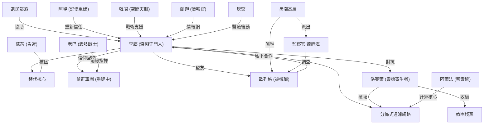

# 第五卷：臨界倒數（構思草案）

## 卷核心一句話
在 417 天倒數計時下，李塵一邊修築「分佈式過濾網路」取代瀕死的古神過濾器，一邊救回蘇芮、喚醒阿岬、對抗暗中回歸的洛賽爾，並在黑潮高層與教團殘黨的夾縫中確立「深淵守門人」的真正權威。

## 本卷五大目標
1. **過濾網路建設**：將灰階吸能柱從 42 根擴展至 200+ 節點，建成可替代古神心臟的分佈式過濾系統原型。
2. **蘇芮救援**：研發「替代核心」技術，在不癱瘓過濾器的前提下將蘇芮從心臟外壁剝離。
3. **夥伴復歸**：阿岬甦醒但記憶殘缺（人物弧光）、韓昭覺醒空間天賦的副作用、老巴義肢適配的戰鬥力重建。
4. **舊敵新局**：洛賽爾轉型為「靈魂寄生者」在地表蠶食教團殘黨，積蓄力量反撲；歐列格在黑潮高層壓力下被迫選邊。
5. **新威脅登場**：過濾效率下降引發星域異化潮（深淵外溢），「外域汙染」的可見徵兆開始出現。

---

## 核心時間軸設定

### 倒數計時器
- **Day 0**：第五卷開幕（Ch. 120 結束後翌日）
- **Day 417**：過濾器效率降至 33%，汙染濃度超越臨界點 → 外域汙染開始不可逆擴散
- 本卷預計覆蓋 **Day 1 ~ Day 120**（約四個月），為最關鍵的「基礎建設期」

### 過濾效率曲線
| 時間 | 過濾效率 | 事件 |
|---|---|---|
| Day 0 | 33% | 蘇芮獨撐，穩定但低效 |
| Day 30 | 35% | 第一批分佈式節點上線，微幅提升 |
| Day 60 | 40% | 中期目標，節點擴展至 100 根 |
| Day 90 | 38%（回落） | 洛賽爾破壞事件，節點損毀 |
| Day 120 | 45%（卷末） | 替代核心原型完成，蘇芮可望剝離 |

---

## 舊人物穿插規劃

> [!IMPORTANT]
> 用戶要求「以前人物要穿插進去後續章節」。以下是各角色在第五卷中的具體定位與出場規劃。

### 核心角色弧光

#### 蘇芮（守門人）
- **狀態**：滯留塔底心臟外壁，半身結晶化，意識清醒但越來越虛弱
- **穿插方式**：
  - 每 3-4 章以「心跳通訊」形式出場（李塵透過信仰回路與蘇芮的微弱意識對話）
  - 蘇芮在心臟內「學習」過濾器的運作，逐步理解守門人血脈的完整功能
  - 中期：蘇芮發現心臟中有舊帝國守門人留下的「替代核心」設計圖殘片
  - 卷末：結晶化蔓延至蘇芮全身 70%，單獨剝離時間窗口正在關閉
- **人物弧光**：從「被動犧牲者」成長為「主動的過濾器理解者」，她對系統的理解甚至超過李塵
- **情感錨點**：她是李塵「417 天倒數」中最強的個人動機

#### 阿岬（記憶碎片）
- **狀態**：深度昏迷 → Day 15 左右甦醒，但失去 Ch. 60 之後的記憶
- **穿插方式**：
  - 前期：昏迷中偶爾說出關於「黑潮實驗室」座標的夢話（呼應 Ch. 105 伏筆）
  - Day 15 甦醒：不認識阿爾法、不記得深淵之行、不記得自己成為共生體
  - 中期：阿岬重新認識每一個人，重新做出「是否信任李塵」的選擇
  - 後期：記憶碎片以夢境形式零星回歸，每次回歸都伴隨劇烈頭痛
- **人物弧光**：失憶的阿岬用現在的眼睛重新審視李塵——比過去更清醒、更批判。她看到的李塵不再是「老大」而是「一個左眼失明、臉上長著灰色紋路的怪人」
- **劇情功能**：為讀者提供「第三者視角」重新審視主角的異化程度

#### 韓昭（空間裂痕）
- **狀態**：Day 3 恢復意識，但「血肉傳送」的副作用顯現
- **穿插方式**：
  - 前期：身體出現「空間裂隙」，手臂會短暫消失又出現，物品穿過她的身體
  - 中期：灰醫判斷她的空間天賦被「血肉傳送」永久激活，已停不下來
  - 後期：李塵用鍊成爐嘗試「定序」韓昭的空間天賦，將隨機閃爍轉化為可控的短距傳送能力
- **人物弧光**：從「被利用的棋子」到「擁抱自己新能力」的接受過程
- **戰術價值**：成為隊伍的「活體傳送錨點」，大幅提升戰術機動性

#### 老巴（鋼鐵意志）
- **狀態**：左腿截肢，適配灰醫以黑潮繳獲零件改造的液壓義肢
- **穿插方式**：
  - 前期：義肢適配痛苦、復健訓練。脾氣暴躁但不放棄
  - 中期：義肢整合工匠鼠的微電路蝕刻技術，具備力量增幅功能
  - 後期：老巴帶著義肢重返前線，反而比以前更猛（義肢可裝載小型武器模組）
- **人物弧光**：「失去一條腿，換來十條命」——老巴成為團隊中「身殘志堅」的精神圖騰
- **名場面**：義肢第一次在實戰中展現全功率的震撼感

#### 灰醫（生命線）
- **狀態**：🟢 全程活躍，第五卷最重要的後勤角色
- **穿插方式**：
  - 全卷：負責阿岬的記憶恢復治療、韓昭的空間穩定研究、老巴的義肢調整、蘇芮的遠程生命監控
  - 灰醫在本卷中將揭露更多個人背景——他為什麼能掌握如此多的「古代神性穩壓技術」？
  - 伏筆：灰醫的技術來源指向舊帝國醫療部門的遺產
- **劇情功能**：「人性的最後保險絲」。當李塵再次陷入計算衝動時，灰醫是唯一能在技術層面阻止他的人

#### 蘭迦（深淵之耳）
- **狀態**：🟢 活躍
- **穿插方式**：
  - 前期：蘭迦的情報網從地表延伸到深淵入口，成為「天梯維護隊」的領頭人
  - 中期：蘭迦發現教團殘黨在三區秘密重組，帶回關鍵情報
  - 後期：蘭迦的廢童幫成員開始加入信仰回路，使分佈式網路的覆蓋率擴展到底層社區
- **人物弧光**：從「街頭情報販子」成長為「深淵通信官」，正式成為組織的中層幹部

#### 洛賽爾（幽靈之王）
- **狀態**：❓ 下落不明 → 暗中活動
- **穿插方式**：
  - 前期（暗線）：洛賽爾在教團殘黨的混亂中「收割」失去信仰依託的教團信徒靈魂
  - 中期：開始針對分佈式節點（灰階吸能柱）進行精準破壞。每次破壞都伴隨「靈魂抽取」——他在用被竊的靈魂修復自己
  - 後期：重建肉身，以全新面貌出現（佔據了某個教團高層的軀體），成為「新教團」的暗影領袖
  - **卷末大戰**：洛賽爾發動對天梯的大規模襲擊，企圖切斷地面與深淵的連結
- **人物弧光**：從第一卷的「小反派」進化為第五卷的「主要威脅」。他的成長與李塵平行——都是利用信仰/靈魂壯大自己
- **恐怖感**：讀者已經在 Ch. 93 見識過他的精神攻擊手段，現在他帶著更強的力量回來了

#### 歐列格（棋盤上的棋手）
- **狀態**：🟢 軌道上，暫時沉默
- **穿插方式**：
  - 前期：歐列格在黑潮高層的壓力下被要求「交出深淵的開採報告」。他面臨：說實話（暴露碎片與過濾器的存在）= 黑潮主力艦隊壓境；說謊（隱瞞）= 被撤職
  - 中期：歐列格私下與李塵達成「資訊交換同盟」——李塵給予部分深淵技術資料（非核心），歐列格壓下黑潮高層的追問
  - 後期：黑潮高層派出「監察官」抵達星域，歐列格被迫二選一。他最終選擇站在李塵一邊，代價是失去軍銜
  - **劇情價值**：歐列格從「投機者」轉變為「盟友」的心理歷程，展現出黑潮內部並非鐵板一塊
- **人物弧光**：軍人的忠誠 vs 良知的覺醒

#### 阿爾法（進化中的靈魂）
- **狀態**：🟡 受損但存活
- **穿插方式**：
  - 全卷活躍：阿爾法在修復過程中進行「自我升級」——利用損壞的部件思考「什麼是不可替換的」
  - 阿爾法開始展現更多類人情感：對阿岬失憶感到「不便」（他不知道這叫「難過」）
  - 中期：阿爾法獨立提出優化分佈式計算的演算方案，證明其智慧已超越「戰場工具」
  - 後期名場面：阿爾法第一次主動開口說了一句不是命令/報告的話——「老大，我想……她會記得我的。」（指阿岬）
- **人物弧光**：智索鼠的「人化」與李塵的「神化」形成對比

#### 遺民部落
- **穿插方式**：
  - 成為地下「天梯」沿途的駐守者與嚮導
  - 遺民的古語號員教導李塵「舊帝國分佈式維護協議」的殘存知識
  - 遺民年輕一代開始仰慕地面文明，形成「上行派」與「守舊派」的內部矛盾

---

## 劇情階段規劃 (Ch. 121 - 150)

### 第一階段：廢墟中的重建 (Ch. 121 - 130)
*焦點：療傷、重建、分佈式過濾網路的第一階段部署。*

#### Ch. 121：第二天（The Day After）
- **核心**：李塵在戰後廢墟中開始重建。T-17 損毀 40%，鼠群僅存 40%。
- **角色穿插**：灰醫連續手術後崩潰式入睡，蘭迦的報告帶來地面混亂消息（教團地表群龍無首引發的權力真空），阿爾法用僅存的一隻電子眼彙報生存資源盤點。
- **伏筆**：蘇芮透過心跳通訊傳來第一條訊息——「我聽到了……那些還在過濾的聲音……像哭泣。」

#### Ch. 122：記憶黑箱（Black Box）
- **核心**：韓昭醒來，身體出現第一次「空間閃爍」。
- **角色穿插**：灰醫緊急處理韓昭的空間不穩定，老巴第一次嘗試站立（義肢適配測試失敗，摔倒），蘭迦帶來情報——三區教團殘黨正在內鬥。
- **懸念**：阿岬在昏迷中喊出了一串座標數字。

#### Ch. 123：灰階擴張（The Grey Expansion）
- **核心**：李塵規劃分佈式過濾網路的第一期工程——需要在 30 天內將灰階吸能柱從 42 根擴展至 80 根。
- **角色穿插**：工匠鼠群全力生產吸能柱，蘭迦的廢童幫負責秘密部署路線，歐列格（通訊）以物資交換情報。
- **技術線**：每根吸能柱需要搭載「迷你定序模組」（用第三碎片能力微縮化），李塵必須逐一校準，消耗極大。

#### Ch. 124：甦醒（Awakening）
- **核心**：Day 15，阿岬睜眼。她不認識身邊的人（Ch. 60 後記憶全失）。
- **角色穿插**：阿岬看到阿爾法時尖叫——「老鼠！」。老巴笑著說「妳以前比牠還兇」。灰醫進行全面腦神經評估。
- **人物弧光**：阿岬用「陌生人的眼光」描述李塵——「你左眼怎麼了？你臉上那些灰色的東西……是生病了嗎？」李塵第一次從別人的恐懼中看到自己的異化。
- **情感衝擊**：阿岬翻看自己的日記，發現最後幾頁寫著「我願意為老大去死」——現在的她完全無法理解為什麼。

#### Ch. 125：信任測試（Trust Test）
- **核心**：失憶的阿岬拒絕接受「共生體連結」的重新接入。李塵尊重她的決定。
- **角色穿插**：老巴帶阿岬參觀 T-17（她記得的版本比現在小得多），蘭迦的廢童們圍著阿岬叫「阿岬大姐」讓她困惑。
- **暗線**：洛賽爾的影子在三區教團廢墟中第一次顯現——他正在吸收死去教團信徒的殘留信仰。

#### Ch. 126：天梯守衛（Ladder Guard）
- **核心**：建立地面到深淵的永久通道（天梯）的防衛體系。
- **角色穿插**：遺民部落派出年輕戰士協助巡邏，蘭迦的廢童幫成為「通信中繼站」的管理者，老巴帶傷訓練新兵。
- **技術線**：天梯上安裝信仰回路中繼器，讓蘇芮的心跳訊號能清晰傳達到地面。
- **伏筆**：天梯深處的岩壁上開始滲出黑色液體——外域汙染的早期徵兆。

#### Ch. 127：軌道上的風暴（Orbital Storm）
- **核心**：歐列格線。黑潮高層要求歐列格提交「深淵開採可行性報告」。
- **角色穿插**：全章以歐列格視角展開。他在旗艦「重錘號」上回顧塔底之戰的倖存者證詞，做出一個艱難決定——提交一份經過「編輯」的報告，隱瞞神格碎片與過濾器的存在，聲稱深淵「資源價值有限」。
- **風險**：如果被發現撒謊，歐列格將以「叛國罪」被處決。
- **人物弧光**：他為什麼要冒這個險？因為他在塔底親眼看到了「那顆心臟」——他理解了，如果黑潮主力進來挖掘，整個星域都會完蛋。

#### Ch. 128：第一次脈衝（First Pulse）
- **核心**：分佈式過濾網路第一期完工（60 根節點上線）。第一次全網聯動測試。
- **角色穿插**：李塵親自校準最後一根吸能柱，阿爾法負責計算同步，蘇芮從塔底報告心臟負荷的變化。
- **成果**：過濾效率從 33% 提升至 35%。微小但真實的進步。
- **代價**：校準過程消耗李塵大量神性，魂譜裂痕微增至 74%。
- **懸念**：遠處三區方向傳來不明的低頻嗡鳴——那不是教團的讚美詩，而是「更古老的東西」。

#### Ch. 129：影子的收穫（Shadow's Harvest）
- **核心**：洛賽爾正式登場。他佔據了一名教團高階牧師的身體，開始收攏教團殘黨。
- **角色穿插**：蘭迦帶來緊急情報——三區出現了一個「新先知」，教團殘黨正在圍繞他重新集結。李塵感知到那個方向有熟悉的「靈能波紋」。
- **恐怖感**：洛賽爾已經不再是第一卷那個逃竄的敗犬。他吞噬了數百名教團信徒的殘留信仰，力量已今非昔比。
- **暗示**：洛賽爾對教團殘黨說：「你們的大主教被封印了，但他的理念沒有錯。我來繼承它。」

#### Ch. 130：異化潮（The Mutation Tide）
- **核心**：過濾效率下降的第一個宏觀後果——星域外環開始出現大規模生物異化事件。
- **角色穿插**：歐列格報告軌道上的觀測數據（外環的垃圾潮中出現「活化跡象」）。老巴帶隊處理 T-17 附近的異化獸潮（義肢首次實戰）。阿岬站在觀景台上，看到遠方閃爍的灰色光芒（灰階吸能柱），問：「那些是星星嗎？」阿爾法：「不，那是——我們的網。」
- **階段總結**：Day 30 結束。療傷完成，網路雛形建立，舊敵浮現，新危機初露。

---

### 第二階段：博弈與破壞 (Ch. 131 - 140)
*焦點：分佈式網路遭破壞、歐列格被迫選邊、阿岬的「第二次選擇」。*

#### Ch. 131：守門人通訊錄（Gatekeeper's Codex）
- **核心**：蘇芮在心臟裂痕中發現了刻有古文的金屬板——舊帝國守門人的「維護手冊」殘頁。
- **角色穿插**：蘇芮將內容透過心跳通訊逐字傳給阿爾法記錄。遺民古語號員協助翻譯。
- **技術突破**：手冊中記載了「替代核心」的概念——可以用人工結晶體模擬守門人血脈的過濾功能，但需要「活性神格」作為引燃催化劑。
- **兩難**：唯一可用的「活性神格」就是李塵自己的完整神格核心。使用它意味著暫時失去所有高階能力。

#### Ch. 132：陌生的老大（Stranger Boss）
- **核心**：阿岬日常重建信任的過程。
- **角色穿插**：阿岬跟著蘭迦走訪民區，聽到居民講述「阿岬大姐」以前的事蹟。她開始從別人的記憶中拼湊自己。老巴帶她去鼠群巢穴，阿爾法嘗試和她「重新自我介紹」。
- **轉折**：阿岬翻到一張合照（蘇芮的裂羽號上），指著照片問：「這個女生呢？」所有人沉默。
- **伏筆**：阿岬夢中開始出現碎片化的記憶——深淵的場景、心跳聲、以及李塵冰冷的聲音：「如果她死了，可以釋放 12% 算力。」她驚醒，渾身冷汗。

#### Ch. 133-134：節點獵殺（Node Hunting）
- **核心**：洛賽爾開始精準破壞分佈式過濾網路的關鍵節點。
- **戰術**：洛賽爾的陰影分身在夜間滲透灰階部署區，用「靈魂腐蝕」破壞吸能柱的共振核心。每破壞一根，他就能吸收柱內殘留的微量信仰能量。
- **角色穿插**：蘭迦的情報網首先發現異常，阿爾法計算出破壞模式指向「有組織的智能行為」而非隨機異化。灰醫提出被破壞的柱子上殘留的「能量指紋」與 Ch. 93 共生噩夢中洛賽爾的靈能一致。
- **後果**：Day 60 的 100 根節點計畫被打回 80 根，過濾效率停滯在 37% 無法突破。
- **對策**：李塵在每根吸能柱周圍部署「哨戒鼠+影鼠」雙重巡邏，但這進一步分散了本就不足的鼠群兵力。

#### Ch. 135：監察官（The Inspector）
- **核心**：黑潮高層派出「監察官」蕭靜海抵達星域，調查歐列格的報告真偽。
- **角色穿插**：歐列格應對監察官的審問（軍事法庭式的壓迫場景）。李塵通過影鼠監聽軌道通訊，得知監察官船上攜帶了「深層掃描器」——能穿透岩層偵測到塔底的心臟。
- **危機**：如果深層掃描啟動，過濾器的存在將暴露，黑潮主力艦隊必然壓境。
- **決策**：李塵主動通過加密頻道聯繫歐列格，提出交易——「我干擾掃描，你讓監察官滿意地離開。」

#### Ch. 136：全頻阻塞（Full-Spectrum Jamming）
- **核心**：李塵利用「全域廣播」的衍生應用，在整個星域製造持續 72 小時的「深層磁暴」，干擾黑潮的掃描設備。
- **角色穿插**：阿爾法進行複雜的頻率計算，蘭迦提供監察官行程情報，遺民古語號員教導李塵如何用「古代干擾紋」放大效果。
- **代價**：72 小時內李塵無法使用任何高階神性能力。他完全暴露在洛賽爾的攻擊範圍內。
- **轉折**：洛賽爾就在這 72 小時中發動了一次大規模節點攻擊——他在等這個機會。

#### Ch. 137：黑暗三日（Three Dark Days）
- **核心**：李塵神性暫時封鎖的 72 小時中，洛賽爾發動突襲。
- **角色穿插**：
  - **老巴**帶隊在地面迎擊洛賽爾的教團殘黨傀儡部隊（義肢全功率首秀）
  - **韓昭**第一次在戰鬥中使用空間能力——把洛賽爾的影子分身「傳送」到 T-17 防禦圈核心，讓防禦武器集火
  - **阿岬**（記憶未恢復）在混戰中拿起武器保護受傷的灰醫——「我不記得你們是誰，但你們顯然不該死在這裡。」
  - **阿爾法**指揮殘餘鼠群進行「人海（鼠海）戰術」，以身體堵住洛賽爾靈能攻擊的傳導路徑

#### Ch. 138：選擇（The Choice）
- **核心**：歐列格在監察官面前做出最終選擇。
- **角色穿插**：監察官拿出「未被干擾前」的異常數據（在磁暴前最後一秒掃到的模糊影像），質問歐列格。歐列格沉默了三十秒，然後說：「那是過濾器。如果你把它挖出來，整個星域會在一年內不適合人類居住。」
- **後果**：監察官將此定性為「歐列格的妄想」，準備撤走並建議黑潮高層「在必要時更換指揮官」。但歐列格知道，他的時間不多了。
- **人物弧光**：歐列格靠上椅背：「我從軍三十年。第一次為了不服從命令而驕傲。」

#### Ch. 139：重逢（Reunion）
- **核心**：阿岬在 Ch. 137 的戰鬥中觸發了身體的「肌肉記憶」——戰鬥姿態、信號手勢、甚至下意識地呼喚「阿爾法，右翼！」
- **角色穿插**：灰醫判斷這是「程序性記憶」的殘留（大腦損傷主要影響情景記憶，技能記憶保存較好）。阿岬開始主動要求恢復訓練。阿爾法安靜地陪在她身邊，計算她的復健進度。
- **名場面**：阿岬第一次摸阿爾法的頭——「你很醜。但我覺得我以前應該很喜歡你。」阿爾法：「……數據記錄顯示，你給我取了六個綽號。我最討厭的那個叫『小破爛』。」

#### Ch. 140：過濾告急（Filter Alert）
- **核心**：Day 90。洛賽爾的破壞加上自然衰減，過濾效率降至 38%。蘇芮的結晶化蔓延至 60%。
- **角色穿插**：蘇芮的心跳通訊越來越微弱，暗示她的意識正在被過濾器同化。李塵在通訊中聽到蘇芮的聲音夾雜著「古神的語調」——她正在「變成」下一代過濾器。
- **決斷**：李塵拍桌：「不等了。替代核心的研發提前。」
- **階段總結**：Day 90 結束。網路遭受嚴重破壞、歐列格選邊、阿岬開始回歸、蘇芮危在旦夕。

---

### 第三階段：替代核心與卷末大戰 (Ch. 141 - 150)
*焦點：替代核心製造、洛賽爾全面攻擊、蘇芮剝離。*

#### Ch. 141-142：鍊成（The Forging）
- **核心**：李塵根據蘇芮找到的守門人手冊，開始鍛造「替代核心」。
- **技術路線**：以「重力藤壺結晶」為基底，注入阿爾法計算的定序方程式，最後用李塵的完整神格做短暫催化——點燃核心後立即撤回神格。
- **角色穿插**：
  - 灰醫警告催化過程中神格的「回收失敗率」為 22%——有可能回不來
  - 阿岬主動要求恢復共生體連結（她已做出「第二次選擇」）——「我不記得我為什麼信你。但這幾個月……你沒讓任何人因為你的計算而死。至少沒有故意的。」
  - 歐列格從軌道上空投了一批「超導合金」——他的最後一份禮物，因為他即將被撤職

#### Ch. 143-144：天梯之戰（Battle of the Ladder）
- **核心**：洛賽爾發動對天梯的全面攻擊。他的目標是切斷地面與深淵的連接，讓蘇芮在孤立中被過濾器完全同化。
- **戰場**：天梯垂直空間內的立體攻防戰。洛賽爾派出「魂傀儡」部隊（被靈魂控制的教團殘黨肉體）。
- **角色穿插**：
  - **老巴**帶隊守天梯上段，義肢的力量增幅器撕裂魂傀儡的護甲
  - **韓昭**利用空間閃爍在天梯各層間快速傳送補給和傷員
  - **蘭迦**指揮廢童幫在天梯暗道中進行側翼游擊
  - **阿岬**帶領恢復編制的地面部隊阻擋教團殘黨的地表攻勢
  - **阿爾法**統籌全域戰術，同時保護正在進行替代核心最終校準的李塵

#### Ch. 145-146：深淵降臨（Descent）
- **核心**：李塵攜帶替代核心，獨自通過天梯下到塔底。
- **角色穿插**：遺民部落在天梯沿途提供安全走廊。蘇芮的心跳通訊已極度微弱——「快……我快要聽不到自己的聲音了……」
- **高潮**：李塵到達心臟腔室，發現蘇芮已有 70% 結晶化。她仍然在微笑：「你來了。我就知道你會來。」
- **技術流程**：安裝替代核心 → 用神格催化啟動 → 將蘇芮從心臟外壁剝離 → 替代核心接管過濾功能

#### Ch. 147-148：替換（The Swap）
- **核心**：替代核心啟動過程中，洛賽爾本體趁天梯之戰的掩護，潛入塔底。
- **衝突**：洛賽爾的目標不是碎片，而是蘇芮——他要在蘇芮被剝離的瞬間，竊取她與心臟之間的「過濾權限」，讓自己成為新的「守門人」。
- **角色穿插**：
  - 李塵正在催化替代核心，神格暫時不可用，面對洛賽爾幾乎無法還手
  - 阿爾法通過天梯通訊呼叫支援，但天梯戰場被堵死
  - **蘇芮覺醒**：在被剝離的過程中，蘇芮短暫獲得了完整的「守門人權限」——她用最後的力量，將「過濾免疫屏障」覆蓋在李塵和替代核心上，把洛賽爾擋在過濾場之外
- **結果**：替代核心啟動成功。蘇芮被成功剝離，但陷入深度昏迷（結晶化殘留需長期治療）。洛賽爾被過濾場的免疫反應灼傷，再次遁逃。

#### Ch. 149：歸來（The Return）
- **核心**：李塵帶著昏迷的蘇芮回到地面。天梯之戰已結束。
- **角色穿插**：
  - 灰醫接手蘇芮的治療——她的生命體徵穩定，但何時醒來未知
  - 老巴坐在廢墟上抽煙，義肢冒著熱氣：「以後能不能少來幾次世界末日？」
  - 阿岬站在門口等他們回來。她不記得蘇芮，但她記得——「你說過你會回來接她的。」
  - 歐列格從軌道發來最後一條加密訊息：「我被撤職了。但我的副官會繼續配合你。祝好運，守門人。」
  - 韓昭靠在牆上，手臂上的空間裂隙穩定地閃爍——她已經學會控制它了

#### Ch. 150：417 減 120（The Remaining Days）
- **核心**：卷末狀態總結與新倒數。
- **數據更新**：
  - 過濾效率：45%（替代核心 + 200 節點分佈式網路）
  - 剩餘時間：297 天（比原計劃延長了因為效率提升）
  - 蘇芮：深度昏迷，結晶殘留需治療
  - 阿岬：記憶恢復約 30%，已重新加入戰鬥序列
  - 洛賽爾：再次遁逃，但力量嚴重削弱
  - 黑潮：歐列格被撤職，新任指揮官態度不明
- **章尾獨白**：李塵站在 T-17 頂層。曙光中，分佈式過濾網路的灰色光點如星辰般散佈在整個灰環——比 Ch. 120 末尾多了五倍。
  - 李塵：「297 天。夠了。」
  - 阿爾法：「計算修正——如果考慮到外域汙染的加速因子，實際可用時間為 263 天。」
  - 李塵：「……也夠了。」
  - 遠處，一顆從未見過的黑色星體正在星域邊緣若隱若現。阿爾法的數據日誌中多了一條未被任何人注意的記錄：「偵測到非自然物體進入星域引力圈。體積：未知。速度：加速中。」
  - **第五卷完。**

---

## 新設定元素

### 替代核心（Substitute Core）
- **原理**：以「重力藤壺結晶」為載體，植入從古神心臟中逆向工程的定序方程式，模擬守門人血脈的過濾功能
- **限制**：效率僅為原心臟的 12%（作為單體），但可與分佈式網路協同，整體效率可達 45%
- **維護**：需要定期以信仰能量充能（每 30 天一次）

### 洛賽爾的進化路線
- **靈魂寄生**：佔據他人肉身的新能力（在教團殘黨中積蓄）
- **信仰寄生**：竊取既有信仰網路的能量，與李塵形成「信仰掠奪者 vs 信仰建設者」的對比
- **長期定位**：成為第一部（Ch. 1-250）的持續威脅，直到第一部結尾才被徹底解決

### 異化潮（Mutation Tide）
- **起因**：過濾效率下降導致外域汙染在星域邊緣累積
- **表現**：底層生物異化加速、垃圾潮中出現「活化垃圾」（金屬與有機物融合的新型怪物）
- **劇情功能**：讓「417 天倒數」不再只是數字，而是肉眼可見的迫切危機

### 蕭靜海 (黑潮監察官)
- **身分**：黑潮物流盟中央監察署特派員
- **性格**：冷酷、精確、不受賄。歐列格形容他為「比電腦更難說服的人」
- **後續定位**：第六卷可能以更高軍銜重返星域

---

## 多勢力關係圖（第五卷末）

---

## 伏筆清單（為第六卷及後續準備）

1. **黑色星體**：卷末出現的不明天體——暗示「外域掠奪者」的前哨探測器？對應宏觀規劃的「第二部：深淵遠征篇」前奏。
2. **蘇芮的守門人全權限**：她在 Ch. 147 短暫獲得的「完整守門人權限」是否會被永久保留？如果能，她將成為第二代過濾器的核心操作者。
3. **歐列格的副官**：新的黑潮聯絡人，性格與立場待定。
4. **阿岬的遺失記憶**：Ch. 105 中在阿岬潛意識深處的「黑潮實驗室座標」——她失去了情景記憶但這個座標仍在。
5. **洛賽爾的傷痕**：被過濾場灼傷意味著他體內帶有「過濾標記」——未來可被追蹤。
6. **韓昭的成長**：她的空間能力是否能進一步進化為「空間錨點」級別，取代或輔助李塵？
7. **異化潮升級**：外域汙染加速意味著更大規模的生態崩壞——可能催生新型深淵生物。
8. **灰醫的背景**：舊帝國醫療部門的遺產——灰醫是否也是某種「守門人計畫」的後裔？

---

## 待辦任務對接（進度檢核）

| 進度檢核任務 | 對接方式 | 卷內位置 |
|---|---|---|
| **第五卷規劃** | ✅ 本文件即為規劃草案 | 全卷 |
| **蘇芮救援線** | ✅ 替代核心技術路線（Ch. 141-148） | 第三階段 |
| **全本巡檢 (Ch. 91-110 字數)** | 🔄 需另行執行，非劇情構思範疇 | N/A |
