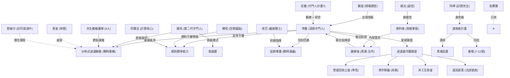

# 第六卷：黑星降臨（構思草案）

## 卷核心一句話
不明黑色天體逼近星域，陳鋒的「消極防禦」被蕭靜海的「軍事接管」取代，李塵在 263 天倒數中整合中小勢力、徹底剿滅洛賽爾的「亡靈遺產」，並在薩爾筆記指引下探索神格進化與灰醫救援之路，最終在黑星探針的規則腐蝕下，建立真正獨立的星域防線。

## 承接第五卷末狀態

| 項目 | 狀態 |
|---|---|
| **過濾效率** | **41%**（替代核心 + 80 根灰階吸能柱） |
| **倒數** | **297 天（凍結）**（替代核心暫停擴散） |
| **蘇芮** | **已甦醒**，結晶化 65%（穩定），接管 T-17 醫療部，同時操作過濾網絡 |
| **灰醫** | **沉睡**，靈魂植入心臟壁成為看護者，偶爾通過心臟脈動傳遞夢境訊號 |
| **阿岬** | 記憶恢復 **20%**，共生體一級連結，灰港實質指揮官 |
| **洛賽爾** | **已死（灰飛煙滅）**，殘黨分裂為無主勢力，過濾標記異化獸失控 |
| **歐列格** | **已離開**，副官衛子昂留守軌道作為秘密聯絡點 |
| **黑潮** | 新任指揮官 **陳鋒**（蕭靜海推薦，消極防禦派）已到任 |
| **薩爾筆記** | **已取得**，列為絕密，記載「無損靈魂提取」技術與神格進化路徑 |
| **鼠群規模** | **2,780 隻** |
| **鍊成爐** | 古神記憶解析 89%，階段一（定序）滿載運轉 |

---

## 本卷五大目標

1. **星域整合**：以「過濾器守護聯盟」名義收編灰環中小勢力（公會、黑市、井工互助會），建立統一指揮體系，填補洛賽爾死後的權力真空。
2. **指揮權之爭**：從陳鋒的「消極共存」到蕭靜海二度降臨的「軍事接管」，李塵必須在黑潮內部的路線之爭中保住星域自治權。
3. **灰醫救援伏線**：研讀薩爾筆記，尋找神格進化至 100% 的契機（無損提取灰醫靈魂的前提），同時通過「心臟夢境」獲取灰醫關於舊帝國技術的指引。
4. **遺產清掃**：清理洛賽爾留下的「自動化威脅」（失控標記獸群、教團殘黨、薩爾筆記中的禁忌技術），防止其被黑潮獲取。
5. **外域前哨**：黑色星體被確認為非自然物體（外域探針），其釋放的「規則腐蝕」首次衝擊過濾網路，讓全星域見識到真正的敵人。

---

## 核心時間軸

| 時間 | 過濾效率 | 事件 |
|---|---|---|
| Day 120 | 41% | 第六卷開幕，陳鋒到任 |
| Day 135 | 45% | 薩爾筆記解讀突破，發現神格進化路徑 |
| Day 150 | 40% (波動) | 洛賽爾遺產爆發（失控獸群），蕭靜海帶艦隊二度降臨 |
| Day 180 | 35% (受壓) | 黑潮軍事接管，李塵發動「軟性抵抗」 |
| Day 200 | 28% (腐蝕) | 黑星探針釋放規則腐蝕，蕭靜海部隊受創 |
| Day 220 | 33% (回升) | 聯合防禦建立，李塵展示規則干擾 |
| Day 250 | 52% (卷末) | 偽裝層啟動，黑星休眠，星域獲得有限自治 |

---

## 角色弧光

### 蘇芮（雙重身分）
- **前期**：身兼二職（醫療主管 + 過濾核心操作者），過度勞累。試圖模仿灰醫的語氣寫病歷，但掩蓋不住自己的溫柔。
- **中期**：在對抗規則腐蝕時，她展現出比灰醫更強的直覺——她能「聽懂」汙染的語言，而不只是分析數據。
- **後期**：完全接納「第二代守門人」的身分，不再模仿灰醫，而是用自己的方式守護大家（包括沉睡的灰醫）。

### 阿岬（記憶與身分）
- **前期**：記憶恢復至 20%，但「黑潮實驗室座標」仍深埋潛意識。
- **中期**：在對抗黑潮的行動中，阿岬的肌肉記憶引導她進入一座廢棄的黑潮設施——正是她潛意識中的座標。發現自己曾是黑潮的「適格者實驗體」。
- **後期**：記憶全面回歸，包括她為何逃離黑潮、為何來到垃圾場。她選擇將這個秘密告訴李塵：「我不是偶然來到這裡的。」
- **弧光**：身世揭露不是終點，而是她重新選擇「站在哪一邊」的起點。

### 歐列格（遙遠的盟友）
- **前期**：已離開星域，以加密頻道遠程協助李塵理解黑潮動向。副官衛子昂作為駐留代表。
- **中期**：蕭靜海宣布接管後，歐列格成為關鍵的情報仲介——他了解旗艦的所有弱點。
- **後期**：在最終對峙中，歐列格發送遠程全息演說，由衛子昂在重錘號艦橋廣播，分裂黑潮艦隊忠誠。
- **弧光**：「被撤職的軍人」證明瞭即使不在場，他的信念依然能守護這裡。

### 蕭靜海（軍人的執念）
- **前期**（未出場）：通過陳鋒的報告間接存在。對星域現狀保持觀察。
- **中期**：因陳鋒「辦事不力」（無法控制洛賽爾遺產擴散），帶領第三主力艦隊親臨，態度強硬：「我給過你們自治機會，但你們搞砸了。」
- **後期**：在黑星規則腐蝕面前，親眼目睹黑潮科技的無力，最終承認李塵的過濾技術是唯一防線，轉變為「務實的盟友」。
- **結局**：與李塵達成「有限自治協議」——星域保持獨立，但向黑潮提供過濾技術授權。

### 洛賽爾（亡靈的陰影）
- **狀態**：已死。但他的「過濾標記」像病毒一樣在異化獸群中擴散。
- **影響**：他死前啟動的「末日協議」在 V6 中期被觸發——不是為了勝利，純粹是為了噁心活著的人。真正的「反派」變成了他殘存的意志與程序。

### 灰醫（心臟裡的幽靈）
- **狀態**：物理沉睡。意識活躍。
- **表現**：通過心臟脈動干涉李塵和蘇芮的夢境。在夢中，他不再是那個嘮叨的醫生，而是站在舊帝國廢墟上的「記錄者」，指引李塵尋找薩爾筆記的解讀關鍵。
- **身世**：夢境中逐漸揭露他曾是舊帝國「守門人量產計畫」的失敗品（殘次品），這解釋了他為何擁有那些穩壓技術。

---

## 劇情階段規劃 (Ch. 151 - 180)

### 第一階段：聯盟與暗流 (Ch. 151 - 160)
*焦點：星域整合、蘇芮雙職、黑潮新官上任。*

#### Ch. 151：新秩序（New Order）
- **核心**：李塵以「深淵守門人」身分召集灰環各勢力領袖，提出「過濾器守護聯盟」構想。陳鋒上校作為新指揮官首次出席（旁觀）。
- **角色**：蘭迦佈置會場安保，老巴帶義肢站在李塵身後充當「威懾力」。阿爾法投影過濾效率數據 41%。
- **鼠群部署**：阿爾法以智索鼠身分同步調度全域鼠群進入「戰時動員態」——4 組獵殺群沿 T-17 外圍佈防，200 隻哨戒鼠形成三層預警網。李塵展示鼠群覆蓋範圍：「這是你們加入聯盟後能獲得的保護。」
- **衝突**：公會副會長「季恆」質疑李塵的動機（V1 時的中層，現上位）。黑市盤口老手「烏鴉」要求「技術分紅」。陳鋒冷眼旁觀：「只要不影響軌道指標，你們隨便談。」
- **結局**：初步達成框架協議——各方提供資源與人力（規則線：取得合法授權），換取過濾網絡的「污染保護圈」優先覆蓋。

#### Ch. 152：筆記與夢（Notes and Dreams）
- **核心**：李塵研讀薩爾筆記。蘇芮嘗試適應無灰醫的醫療部。
- **夢境**：李塵在工坊睡著。夢見灰醫站在巨大的心臟前，指著筆記的第四章：「別看公式。看眉批。薩爾是個瘋子，但他的眉批是寫給人看的。」
- **蘇芮**：接手醫療部後第一場大手術（替一個礦工接斷指）。她習慣性地回頭喊「灰醫遞鉗子」，然後看著空蕩蕩的身後沉默了兩秒，自己拿起了鉗子。
- **發現**：醒來後對照眉批，發現薩爾筆記中隱藏的「神格純化法」。

#### Ch. 153：鋼鐵之手（Iron Hand）
- **核心**：V6 危機初現。T-17 外圍出現異常異化獸群，無領袖但在執行戰術配合。
- **陳鋒反應**：選擇「視而不見」以保持指標數據好看。
- **衛子昂**：從軌道秘密發訊給阿爾法：「檢測到異常訊號源，頻率與之前的洛賽爾吻合。小心。」
- **策略**：李塵決定不依賴軌道支援，自行處理。

#### Ch. 154：失控（Out of Control）
- **核心**：標記獸群數量激增。陳鋒終於被迫行動，選擇「軌道轟炸」解決，結果誤傷了灰環平民區。
- **衝突**：李塵要求停止轟炸。陳鋒：「我的指標是異化獸數量歸零。平民傷亡不在指標內。」
- **行動**：李塵派出鼠群，在轟炸區和獸群之間建立緩衝帶。蘇芮開啟過濾護盾保護平民（神性輸出：護盾效率實測）。

#### Ch. 155：夢中身世（Origin in Dreams）
- **核心**：蘇芮在操作過濾器時「聽」到了灰醫的聲音。
- **審計**：蕭靜海雖然人沒到，但派來了「技術審計組」（規則線：黑潮試探過濾權限）。審計官「沈默」被過濾頻率共鳴——他體內有微量神性。
- **夢境揭露**：當晚蘇芮夢見灰醫與沈默在舊帝國實驗室重疊的影子。無數個培養皿。灰醫（年輕版）看著另一個失敗品被銷毀。
- **啟示**：這解釋了灰醫為何對「替代核心」技術如此排斥又如此精通。他曾是那個「替代品」。沈默可能是另一批「適格者」。

#### Ch. 156：亡靈清掃（Undead Cleanup）
- **核心**：李塵決定主動出擊，清剿洛賽爾雖死猶存的教團據點。
- **發現**：在據點深處發現薩爾筆記的下半部殘頁。記載了「外域探針」的特徵。
- **危機**：殘黨啟動了洛賽爾的「死手系統」——將所有標記獸群引向 T-17。阿岬在戰鬥中感覺到了從未有過的熟悉感——這個據點的佈局和她記憶深處的某個地方重疊。

#### Ch. 157：鼠群戰爭·序（Swarm War: Prelude）
- **核心**：死手系統引發的獸潮前鋒抵達。
- **戰術布局**：阿爾法指揮。4 組獵殺群（120 隻）佈防，輻射鼠群待命。
- **對抗**：阿岬帶領前線部隊（包含公會保鏢與黑市打手）在第一線建立防線。這是聯盟成立後的第一次聯合作戰（規則線：驗證聯盟指揮權）。

#### Ch. 158：鼠群戰爭·終章（Swarm War: Finale）
- **核心**：戰鬥高潮與「戰爭循環」。
- **循環啟動**：獵殺群交戰 15 分鐘後撤回，煉骸鼠進場轉化屍體。種母鼠在後方利用轉化的骸能核快速繁殖。
- **數據**：72 小時內戰損 47 隻，補回 68 隻（含 15 隻高品質）。淨增長 +7。
- **結局**：鼠群慘勝。蘇芮看著戰損數字，第一次理解了李塵的「冷酷」——這是在用敵人的屍體養自己的軍隊。
- **戰利品**：從獸群核心提取出「亡靈信標」。

#### Ch. 159：問責與星光（Accountability）
- **核心**：陳鋒因「平民誤傷」和「獸群失控」被黑潮高層問責。
- **消息**：衛子昂從軌道發來急電：「蕭靜海要來了。帶著第三艦隊。陳鋒被撤了。」
- **星光議會**：李塵再次召集聯盟，宣布即將到來的真正風暴。古語號員（來自遺民部落）首次發言：「天上的眼睛（蕭靜海）要來了。地下的眼睛（黑星）也在看。」

#### Ch. 160：前兆（Omen）
- **核心**：阿爾法觀測到星域邊緣的空間扭曲。
- **影像**：一顆黑色的、不反光的球體。薩爾筆記中的插圖成真了。結尾，蕭靜海的旗艦躍遷進入軌道，陰影覆蓋了 T-17。

---

### 第二階段：軍管與對抗 (Ch. 161 - 170)
*焦點：蕭靜海的強硬手腕、星域封鎖、李塵的軟抵抗、洛賽爾終局。*

#### Ch. 161：軍管令（Martial Law）
- **核心**：蕭靜海落地。宣布 T-17 為軍事禁區，要求李塵交出過濾核心控制權。
- **對抗**：李塵拒絕。「這是我的心臟。我的網。你要就自己來拿。」蕭靜海下令切斷補給。
- **歐列格**：遠程發訊：「別硬碰硬。他帶了攻城級武器。」

#### Ch. 162：飢餓遊戲（Hunger Game）
- **核心**：物資封鎖。星域物價飛漲。
- **應對**：蘭迦動用地下走私網維持供給（規則線：黑市網絡價值凸顯），老巴帶隊獵殺異化獸。鼠群成為關鍵補給線——煉骸鼠轉化營養膠。
- **軟抵抗**：蘇芮微調過濾頻率，讓蕭靜海基地範圍內的過濾效率略微下降，製造恐慌（神性輸出：精確打擊）。

#### Ch. 163：筆記突破（The Breakthrough）
- **核心**：李塵在被封鎖期間閉關研究薩爾筆記。
- **進展**：發現神格純化的關鍵在於「複雜度」。
- **適格者線索**：阿岬將舊據點發現的數據交給李塵。與灰醫夢境中的實驗室重疊。阿岬確認：「這是我曾經待過的地方。」

#### Ch. 164：第二次夢境（Dream II）
- **核心**：灰醫再次入夢。
- **警告**：灰醫指著黑星的方向：「它不是星體。它是個翻譯器。它在翻譯我們的規則。」
- **鏈接**：灰醫透露他在心臟裡感應到了外域的波動——心臟本能地在恐懼。

#### Ch. 165：腐蝕初現（Corrosion Starts）
- **核心**：黑星釋放第一波探針。落地點：黑潮的一個前哨站。
- **現象**：前哨站的重力突然反轉。士兵飄向太空。
- **蕭靜海**：震驚。常規物理防護無效。

#### Ch. 166：共同敵人（Common Enemy）
- **核心**：規則腐蝕波及黑潮艦隊——一艘驅逐艦失控撞向旗艦。
- **談判**：蕭靜海被迫解除封鎖，因為他的艦隊在污染區域同樣脆弱。
- **協議**：李塵提議「聯合防禦」。蕭靜海：「你在用恐懼交易。」李塵：「不，我在用事實交易。」（規則線：簽署臨時停戰協議）

#### Ch. 167-168：狩獵行動（The Hunt）
- **核心**：利用 30 天停戰窗口，李塵傾全力圍剿洛賽爾。
- **戰術**：蘇芮以守門人權限將「過濾標記」的追蹤信號放大，配合阿爾法的計算矩陣，精確定位洛賽爾藏身的廢棄礦井。共生體維護隊在戰鬥中充當「信仰回路增幅器」——他們分佈在圍剿圈的九個方位，構成一張靈能雷達網，讓洛賽爾無處遁形。
- **鼠群全面出擊**：阿爾法制定「獵殺方案·終章」——這是 V6 最大規模的鼠群作戰：
  - **第一波（清掃）**：4 組獵殺群（120 隻）+ 輻射鼠群分三路合圍洛賽爾的腐蝕軍團。獵殺鼠以「血霧共鳴」壓制異化獸群，輻射鼠群的生化光環克制被腐蝕的生物組織。空鼠封鎖礦井上方領空，防止洛賽爾的靈魂逃脫。
  - **第二波（消耗）**：洛賽爾的腐蝕軍團約 200 頭異化獸，數量優勢明顯。但阿爾法啟動**完整戰爭循環**——獵殺群每輪交戰 15 分鐘後撤回，煉骸鼠立即進場轉化屍體。種母鼠在後方安全區連續孕育，祈禱鼠全程灌注。**每一輪獵殺結束後 6 小時，戰損被補回且質量更優**。三輪下來，獵殺鼠的血霧共鳴密度比開戰時反而提升了 20%——因為新生幼鼠帶有祈禱鼠灌注的高品質信仰。
  - **第三波（突破）**：洛賽爾發現自己的「嘍囉」越打越少，對面卻「越打越多」。他終於理解了李塵的戰爭機器本質——「你在用我的士兵養你的軍隊。」李塵：「從第一卷就是這樣。你忘了最早的噬靈鼠是怎麼來的？」
  - **戰損統計**：獵殺鼠陣亡 47 隻，空鼠陣亡 12 隻，煉骸鼠轉化效率因腐蝕物質過載損失 2 隻。但種母鼠在 72 小時內補回 68 隻幼鼠（含 15 隻「崇敬」級高品質個體）。淨增長 +7。
- **戰場**：多線同步作戰——老巴正面突擊、韓昭空間傳送突襲側翼、蘭迦切斷退路、阿岬帶隊清掃腐蝕軍團。
- **高潮**：洛賽爾以最後的力量引爆礦井中積蓄的腐蝕能量，企圖與李塵同歸於盡。噬靈鼠群先行衝入，以靈魂干擾削弱爆炸核心穩定性。阿岬衝入爆炸核心，以共生體連結為錨，將洛賽爾的靈魂核心拖出——「你在我記不得的日子裡傷害了我的人。但我現在全想起來了。」
- **戰爭循環的倫理暗影**：戰後清掃時，蘇芮看著煉骸鼠吞噬腐蝕軍團的屍體，面色複雜。李塵的痛覺增幅器在這一刻劇烈震動——他意識到自己在看到屍體時的第一反應是「多少骸能核」而不是「多少條命」。這正是 V3 中蘇芮質問的預言成真：「你開始**期待**他們死，不是嗎？」
- **六卷回扣**：
  - （回扣 V1 Ch. 14-19）洛賽爾的靈魂核心碎裂時，數百道微弱的光從中飄出——那是他從第一卷起在鼠籠城底層收割的所有靈魂，終於被釋放。阿爾法統計：「靈魂殘影計數：347。」
  - （回扣 V4 Ch. 93）阿岬的記憶完全恢復包括共生噩夢中洛賽爾的觸鬚——她衝入爆炸核心不是衝動，而是「我記得你在我腦子裡放了什麼。我來還給你。」
  - （回扣 V5 Ch. 122）洛賽爾臨死前最後一句話：「你的眼睛……我放進去的那顆……看到了什麼？」——回應他在 V5 中通過投降者傳話「你收留了我的眼睛，謝謝。」李塵冷冷回答：「什麼都沒看到。你的東西早就被清乾淨了。」
- **結局**：洛賽爾被徹底消滅。阿岬受傷但存活——她的記憶在戰鬥的極端壓力下全面回歸。戰後鼠群規模達 4,620 隻（有史以來最高），但李塵在清點時只看到數字，而不是一個個活著的生命。

#### Ch. 169：軍人的選擇（A Soldier's Choice）
- **核心**：歐列格線高潮。
- **事件**：蕭靜海收到黑潮高層的最新命令——「不惜一切代價獲取過濾技術」。這意味著可以動用武力。
- **歐列格行動**：歐列格的副官「姚北」（V5 Ch. 149 中接替聯絡工作的人）秘密安排歐列格登上重錘號。歐列格在艦橋向舊部下與新艦員發表演說：「我在這片星域服役了十二年。我見過最勇敢的人不是穿軍服的。如果我們開火，毀掉的不是一個叛軍——是唯一能擋住那個東西（指向黑星）的屏障。」
- **鏡像呼應**：蕭靜海在旗艦上看完演說的通訊截獲錄像後，第一次長時間沉默。他的副官問：「要下令逮捕嗎？」蕭靜海：「……歐列格在 V5 選擇站在他們那邊時，我以為他瘋了。現在看那顆黑星的掃描數據……」他沒有說完。這一刻，蕭靜海開始走上歐列格走過的路。
- **結果**：重錘號全艦投票——62% 的艦員拒絕執行攻擊命令。蕭靜海的艦隊分裂。姚北在投票後向歐列格發送加密短訊：「我也投了反對。」

#### Ch. 170：裂痕（The Rift）
- **核心**：Day 210。黑星距星域只剩 90 天路程。
- **數據**：過濾效率 42%。洛賽爾已死，但外域腐蝕持續且加速。阿爾法計算出黑星正在「搜索」核心節點。
- **階段總結**：蕭靜海看完數據後第一次露出非冷酷的表情。「……你們真的在守一扇門。」

---

### 第三階段：外域之影 (Ch. 171 - 180)
*焦點：黑星到達、第一次外域接觸、星域防衛戰、新秩序確立。*

#### Ch. 171：戰時重構（War Construction）
- **核心**：全星域進入戰時狀態。
- **建設**：蘇芮主導過濾網路「戰時重構」——將 300 個節點從均勻分佈改為「盾陣」配置，集中防護核心區域。共生體維護隊被拆散分配到每個盾陣扇區擔任「即時修復班」。遺民部落在天梯沿途建立三座「中繼祭壇」——古語號員以古法頌唱幫助穩定天梯段的過濾頻率，效果出乎意料地好。灰醫推測遺民的古法本身就是過濾器操作手冊的「口傳版」。
- **節點鼠誕生**：李塵用鍊成爐趕製抗腐蝕型節點時靈感突發——300 個節點的日常維護占用大量人力，而鼠群的信仰回路本來就能感知節點狀態。他以影鼠為藍本，鍊成出一種新鼠種——**「節點鼠」**：體型如工匠鼠，背部皓生微型灰階結晶，可直接貼附在過濾節點上與之共生。節點鼠能即時清理微量腐蝕、充當生物中繼天線、並在節點攟障時通過信仰回路向阿爾法報警。首批 30 隻節點鼠部署後，節點維護效率提升 40%，共生體維護隊得以將人力集中在更關鍵的任務上。
- **角色**：李塵用鍊成爐日夜趕製新型節點（抗腐蝕型）和節點鼠，魂譜裂痕升至 78%。**痛覺增幅器幾乎每十分鐘觸發一次**——他在戰時部署中不自覺地把每個人計算成了「效率節點」，而不是一個個活人。灰醫警告：「你再這樣下去，裂痕會突破 80%。到那時候不是修復的問題，是你還是不是人的問題。」李塵低頭看手腕上增幅器的紅色指示燈：「它還在響。說明我還是。」
- **蕭靜海**：正式提出「聯合指揮部」方案——他提供軌道火力與通訊網，李塵提供過濾防護。

#### Ch. 173-174：接觸（First Contact）
- **核心**：黑星抵達星域外圍。它停了下來。
- **恐怖**：黑星表面打開一道裂縫，釋放出數百個「探針」——拳頭大小的黑色幾何體，向星域各方向散射。
- **效果**：每個探針落地後，周圍 500 米範圍內的物理規則被徹底改寫。有的區域重力消失，有的區域時間凝固，有的區域物質開始「逆向分解」回基本粒子。
- **戰鬥**：黑潮艦隊對黑星主體開火——能量武器命中後被「吸收」，動能武器被規則場偏轉。常規武力完全無效。
- **鼠群 vs 探針**：阿爾法派出獵殺鼠群試圖攻擊落地探針——獵殺鼠接近 500 米規則場後，血霧共鳴瞬間失效，鼠群的神性回路被「改寫」，30 隻獵殺鼠在規則真空中失去協調，陷入狂躁後多數死亡。這是鼠群**第一次對外域威脅完全無效**的震撼時刻。李塵透過信仰回路感受到每一隻鼠的死亡，痛覺增幅器猾到甋邡——這不是計算引發的痛，而是真實的悲傷。「他們不是數字。」他對阿爾法說。阿爾法沉默很久：「我知道。我記得每一隻的名字。」
- **可怕的發現**：有 3 隻節點鼠在探針規則場邊緣存活下來——它們背上的灰階結晶被「改寫」成了外域的幾何紋路，但信仰回路仍在，它們以異常的頻率向阿爾法回傳資文——那些資文是探針規則場的「翻譯進度」，鼠群意外成為了外域規則的「反向竃聽器」。李塵：「它們被改寫了……但信仰回路沒斷。所以它們技術上還是『我們的』，只是身體被用外域規則重寫了。」這對規則戰爭提供了關鍵情報。
- **反應**：蘇芮以守門人權限擴展過濾場，勉強穩住核心區域的規則。但她承受的負荷讓結晶化再次蔓延至 30%。

#### Ch. 175-176：規則戰爭（Rule War）
- **核心**：李塵以「完整視角」觀察探針的運作原理。
- **發現**：探針不是武器，而是「翻譯器」——它在將本星域的物理規則「翻譯」成外域的規則格式。一旦翻譯完成，黑星就能直接「覆寫」整個星域。
- **對策**：李塵提出「規則干擾」——用定序能力不斷改變本星域規則的「表達方式」，讓翻譯器無法完成工作，拖延時間。
- **代價**：等同於不停地「重寫」星域的物理常數——每次重寫都會讓過濾網路短暫癱瘓。
- **韓昭共鳴**：在規則干擾的過程中，韓昭的空間閃爍突然失控——但不是亂閃，而是她的身體自發地跟著李塵的定序節奏「共振」。李塵注意到，每當韓昭的閃爍與規則改寫同步時，翻譯器的解析進度就會額外回退 3%。蘇芮解釋：「她的空間天賦本質就是一種局部規則重寫——和你做的事情是同一個原理，只是尺度不同。」韓昭被正式加入鐵三角，成為第四個支點——**「護盾-干擾-計算-空間錨」四面體**。這個發現預示著：從「干擾」進化到真正的「規則改寫」，韓昭可能就是那把鑰匙。
- **執行**：蘇芮穩住過濾核心，李塵負責規則干擾，阿爾法計算最優的「亂序序列」，韓昭以空間閃爍提供「干擾增幅」。四人配合構成「護盾-干擾-計算-錨點」四面體。
- **心臟的生命力太強，險些穿透偽裝**。
- **灰醫的功勞**：沉睡的灰醫靈魂在關鍵時刻「安撫」了心臟，將心跳降至每分鐘 10 次。
- **甦醒後說**：李塵感覺到了。阿爾法確認了心跳數據異常（人為控制的降低）。

#### Ch. 177-178：黑星之眼（Eye of the Black Star）
- **核心**：黑星主體對規則干擾做出反應——它開始「聚焦」，所有探針收回，能量集中向過濾網路的核心節點（替代核心所在位置）發射一道「腐蝕射線」。
- **危機**：替代核心的定序方程式被逐行改寫。蘇芮感受到「有一個智慧在對面，它在嘲笑我們的防禦」。
- **轉折**：蘇芮在守門人記憶中找到最後一條訊息——「過濾器的真正功能不是淨化，而是**偽裝**。讓外域無法辨識這個星域中有生命。」
- **啟示**：過濾效率降至 33% 的真正後果不是汙染——而是星域的「偽裝」失效。黑星之所以來，是因為過濾器損壞暴露了星域的存在。
- **決策**：蘇芮：「那就讓我把偽裝修好。」她全力激活守門人全權限，以自身為媒介重建偽裝層。
- **鍊成爐突破——古神記憶完成**：蘇芮揭開「偽裝」真相的同一刻，鍊成爐的古神記憶解析從 89% 跳至 **100%**——最後 11% 是古神在外域入侵前的「最終決策過程」：他們討論過「反攻」的可能性，但最終選擇了「犧牲自己變成過濾器」。記憶中最後一個畫面：古神望向深淵最深處，低語「如果有人能走到那裡，告訴它們我們還在。」這個「那裡」對接第二部「深淵遠征篇」的目的地。魂譜裂痕在解析完成的衝擊下驟升至 **80%**——正好踩在灰醫警告的臨界點上。

#### Ch. 179：偽裝（Camouflage）
- **核心**：蘇芮 + 李塵 + 全星域過濾網路的最終守衛戰。
- **過程**：蘇芮以守門人權限調動所有 300+ 節點的過濾能量，將其從「淨化模式」切換為「偽裝模式」——向外域釋放「此處無生命」的規則信號。
- **代價**：偽裝期間過濾效率歸零，所有汙染防護暫時失效。星域居民在短暫的「規則暴露」中集體出現幻覺與輕度異化。
- **角色**：李塵以鍊成爐維持最低限度的核心區淨化，灰醫帶領所有醫療人員進行緊急處置，老巴指揮地面部隊維持秩序，阿岬安撫恐慌的居民。**天梯以下的遺民受汙染暴露衝擊最大**——古語號員帶領全部落在中繼祭壇上以古法頌唱對抗規則失序。他們的祝禱形成一道微弱但穩定的「規則記憶場」——不是淨化，而是讓天梯段的物理法則「記住」自己原本的樣子。蘇芮感知到後淚流滿面：「他們在做和我一樣的事。只是用歌。」
- **鼠群在規則暴露中的反應**：過濾效率歸零期間，普通鼠群（食腐鼠、工匠鼠）出現大規模狂躁，祈禱鼠拚命維持信仰回路不斷裂。但節點鼠因為直接貼附在過濾節點上，在規則暴露中背部結晶出現「規則改寫」的前兆症狀——和 Ch. 173 的 3 隻存活節點鼠一樣，它們反而變成了規則變化的「活體記錄器」。阿爾法在戰後分析這些資文，獲得了外域規則格式的部分解碼。
- **結果**：黑星的聚焦射線中斷。它「看不見」目標了。經過 12 小時的沉默，黑星緩緩轉向，向星域外移動。
- **但是**：黑星沒有離開。它只是退到了更遠的軌道，進入「休眠」狀態。蘇芮能感覺到——「它還在聽。它在等我們露出破綻。」
- **核心**：統計損失。修復。
- **蘇芮**：結晶化穩定在 68%。她變得更強了。
- **灰醫**：心臟恢復正常跳動。但他依然沉睡。

#### Ch. 180：新的倒數（A New Countdown）
- **核心**：卷末狀態總結。
- **數據更新**：
  - 鼠群規模：約 4,400 隻（防禦戰戰損後）。祈禱鼠 20 隻（損失 2 隻），獵殺群 3.5 組，煉骸鼠 6 隻，種母鼠 3 隻，節點鼠 27 隻（損失 3 隻被規則改寫）
  - 鍊成爐：古神記憶解析 **100%**（完成）。階段二「熔解→分離」前兆已啟動。新增產物：抗腐蝕節點、節點鼠
  - 魂譜裂痕：**80%**（臨界點）
  - 過濾效率：52%（蘇芮直接操控 + 重構的抗腐蝕節點網路）
  - 偽裝層：已啟動，但維持需要持續消耗 15% 的過濾產能
  - 實際可用過濾效率：37%（52% - 15% 偽裝消耗）
  - 倒數天數：重新計算中（偽裝層改變了汙染擴散模型）
  - 蘇芮：結晶化 30%，但精神狀態穩定，正式成為「第二代守門人」
  - 阿岬：記憶完全恢復，開始調查「適格者計畫」的全貌，已鎖定同批適格者 7-12 號「秦嶺」在黑潮體系中的位置
  - 歐列格：被蕭靜海的殘餘部隊接納，恢復准將軍銜。副官姚北成為聯合指揮部的常駐聯絡官
  - 蕭靜海：與李塵簽署「聯合防禦條約」，承認星域自治權
  - 洛賽爾：已死，第一部宿敵線終結。死亡時釋放 347 道靈魂殘影
  - 黑星：休眠狀態，距星域 15 天路程
  - 耶赫沙封印：穩定性下降至 99.3%，因規則腐蝕持續微損
  - 共生體維護隊：存活 9 人，已轉型為過濾網路骨幹運維力量
  - 韓昭：空間能力確認與「規則改寫」同源，成為規則戰爭四面體的第四支點
  - 灰醫：身世線浮出——與舊帝國守門人計畫相關，待第七卷深入揭露
  - 遺民部落：古語號員首次到達地面，中繼祭壇的古法頌唱被證實為「口傳版過濾器手冊」
- **章尾獨白**：
  - 蘇芮站在 T-17 頂層，閉眼。她能感受到每一個過濾節點的脈動，像是自己的心跳在整個星域回響。
  - 李塵站在她身邊，手腕上痛覺增幅器的紅燈安靜地亮著——不痛。此刻他只是在看風景。「古神做了一千年。你打算做多久？」
  - 蘇芮：「不需要一千年。我學到了它所有的錯誤。」
  - 阿爾法：「偵測到黑星表面溫度微幅上升 0.03 度。推測：它沒有失去興趣。另，耶赫沙封印穩定性較上週再降 0.02%。」
  - 遠處，灰環上，一面寫著「守門人聯盟」的旗幟在垃圾潮的風中展開。天梯深處，古語號員的歌聲隱約傳來。
  - **第六卷完。**

---

## 新設定元素

### 外域探針（Outsider Probe）
- **外觀**：拳頭大小的純黑幾何體，表面無任何紋理。
- **功能**：「規則翻譯器」——將本星域的物理法則轉譯為外域格式。
- **威脅**：翻譯完成後，外域可以直接覆寫所有規則。
- **弱點**：翻譯過程需要穩定的採樣環境，持續的規則干擾可延緩進度。

### 過濾器偽裝模式（Camouflage Mode）
- **原理**：將過濾能量從「淨化」切換為「信號遮蔽」，向外域釋放「此處無生命」的規則噪聲。
- **代價**：過濾效率臨時歸零，需要在「淨化」與「偽裝」間分配產能。
- **操作者**：只有守門人血脈（蘇芮）能啟動此模式。
- **持續消耗**：佔用 15% 過濾產能。

### 適格者計畫（Aptitude Program）
- **來源**：黑潮從截獲的古代文獻中逆向工程。該文獻與灰醫持有的舊帝國醫療檔案出自同一套系統。
- **目的**：篩選與改造「能與神性碎片相容」的人類。
- **已知適格者**：阿岬（第七批-7/12，已逃脫）、秦嶺（第七批-12/12，轉調中央艦隊，現蕭靜海麾下列兵）。
- **關聯人物**：灰醫（疑似舊帝國守門人計畫的殘餘產物）、技術官沈默（Ch. 155 共鳴者）。

### 薩爾筆記（Sal's Notebook）
- **來源**：洛賽爾遺產。
- **內容**：舊帝國首席牽魂師的研究記錄。包含神格純化、無損靈魂提取、外域規則解析。
- **作用**：貫穿 V6、V7 的技術指導書。

### 規則干擾（Rule Interference）
- **定義**：利用定序權柄小範圍修改物理常數。
- **限制**：高耗能，高魂譜裂痕風險。
- **意義**：對抗外域規則腐蝕的唯一手段，規則戰爭的初階形式。

### 規則戰爭（Rule Warfare）
- **定義**：以改變物理規則的「表達格式」來對抗外域的規則覆寫。
- **等級**：目前僅為「初階干擾」，遠未達到「主動改寫」層次。
- **對應宏觀線**：與第二部「物理規則修改」的金手指階段（熔解→分離）接軌。

### 灰醫夢境（Grey Doctor's Dream）
- **機制**：灰醫靈魂與心臟共生，通過神性脈動影響李塵/蘇芮的夢境。
- **功能**：傳遞情報、身世揭露、情感紐帶。

---

## 伏筆清單（為第七卷及後續準備）

1. **黑星休眠**：它沒有離開，只是在等待偽裝層出現破綻。第七卷的核心壓力源。
2. **適格者計畫全貌**：阿岬已鎖定同批適格者「秦嶺」的位置。接觸她是第七卷的重要支線——她是潛在的盟友還是黑潮的忠實棋子？技術官沈默的背景也待查。
3. **蘇芮的極限**：直接操控過濾網路 + 偽裝層讓結晶化回升至 30%。她能支撐多久？
4. **規則戰爭的進化**：從「干擾」到「改寫」需要什麼？韓昭的空間能力已被證實與規則改寫同源，她可能是進化的關鍵。對接宏觀線中鍊成爐的「熔解→分離」階段。
5. **蕭靜海的轉變**：他真心接受了「聯合防禦」，還是在等黑潮高層的下一道命令？Ch. 169 中他的沉默暗示了內心動搖。
6. **灰醫的真相**：Ch. 155 和 Ch. 163 已明確暗示灰醫與舊帝國守門人計畫有關。他的穩壓技術和適格者計畫出自同一文獻體系。第七卷應正式揭曉灰醫的完整身世。此線索將在 V7 實地探索中（夢境中看到的實驗室位置）證實。
7. **歐列格與姚北**：歐列格恢復軍銜，姚北成為聯合指揮部聯絡官。這對搭檔能否成為黑潮內部改革的起點？
8. **深淵探索鋪墊**：過濾器偽裝模式的發現暗示——真正的解法不在防禦，而在「前往外域源頭」。遺民古語號員的古法頌唱可能藏有行進路線的線索。這對接第二部「深淵遠征篇」。
9. **耶赫沙封印**：規則腐蝕正在緩慢削弱 Ch. 119 的「空間錨點·絕對封鎖」。穩定性已從 100% 降至 99.3%。如果規則戰爭升級或偽裝層出現波動，封印可能在第七或八卷中達到臨界點。
10. **共生體群體的未來**：9 名存活共生體已從「戰鬥棋子」轉型為「過濾網路運維骨幹」。隨著網路規模擴大，他們是否會發展出獨立於李塵的「集群意識」？
11. **遺民的「口傳手冊」**：古語號員的頌唱被證實具有「規則記憶場」效果。遺民代代相傳的古法中可能藏有更多已失落的過濾器操作知識。
12. **痛覺增幅器的閾值**：V6 末李塵的增幅器在非計算時刻安靜下來——他是真的維持住了人性，還是已經習慣了把痛覺當成背景噪音？

---

## 多勢力關係圖（第六卷末）

